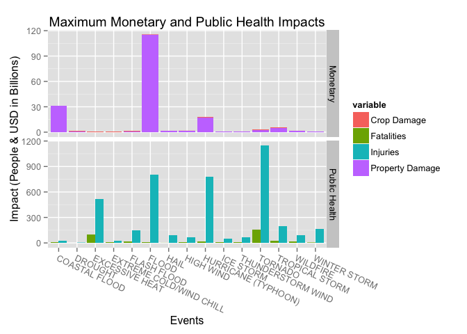
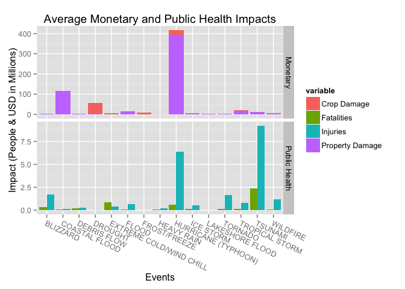

# Economic and Public Health Impact from Storm Events
Scott Brenstuhl  
September 15, 2015  
# Synopsis
We will be exploring the NOAA storm data, which records historic weather events, focusing on events since 1996 when they standardize their event names and began recording them all. We find that in the worse cases of each event, a flood, costal flood, and hurricane caused the most monetary damage. A tornado, hurriane, and flood caused the most injuries, while a tornado, exessive hear, and tropical storm caused the most fatalities. 

When we then go into average events we find that hurricanes, costal floods, and drought usually cause the most damage. While hurricanes, blizards, and tornados usually have the biggest total impact on public health and extreme cold/wind chill causes the most fatalities. 


# Data Processing


```r
library(dplyr)
library(magrittr)
library(lubridate)
library(reshape2)
library(ggplot2)
```

First we read in the NOAA storm data from their database 


```r
get_read <- function(link){
    if(!file.exists('repdata_data_StormData.csv.bz2')){
        download.file(link, 'repdata_data_StormData.csv.bz2', method = 'curl')
    }
    
    read.csv('repdata_data_StormData.csv.bz2')
}    

damage_convert <- function(dmg_exp,dmg_amt) {
    th <- ifelse(storm_data[,dmg_exp]=="K", storm_data[,dmg_amt]*1000, 0)
    mil <- ifelse(storm_data[,dmg_exp]=="M",storm_data[,dmg_amt]*1000000, 0)
    bil <- ifelse(storm_data[,dmg_exp]=="B",storm_data[,dmg_amt]*1000000000, 0)
    th + mil + bil
}

storm_data <- get_read('https://d396qusza40orc.cloudfront.net/repdata%2Fdata%2FStormData.csv.bz2')
```


Then we do a bit of cleanup by convert the damage columns into their numeric values, removing whitespaces, and uppercasing all the event names.

```r
storm_data$propdam <- damage_convert('PROPDMGEXP', 'PROPDMG')    
storm_data$cropdam <- damage_convert('CROPDMGEXP', 'CROPDMG')
storm_data$totaldam <- storm_data$propdam + storm_data$cropdam

# remove rows that dont have any damage or death/injury
impact_events <- storm_data[storm_data$FATALITIES > 0 | 
                                storm_data$INJURIES > 0 | 
                                storm_data$totaldam > 0,]
# Trim whitespaces
impact_events$EVTYPE <- trimws(impact_events$EVTYPE)
# Uppercase
impact_events$EVTYPE <- toupper(impact_events$EVTYPE)
```

The NWSI started tracking standardized event names in 1996, so we will explore the events that have happend since then so that the data will be more consistant. 

```r
# only dates after the 48 NWSI EVTYPES began being tracked
impact_events <- impact_events[mdy_hms(impact_events$BGN_DATE) >= mdy('1/1/1996'),]
```

NWSI has 48 standard storm data events, which can be found in their [Storm Data Documentation](https://d396qusza40orc.cloudfront.net/repdata%2Fpeer2_doc%2Fpd01016005curr.pdf). We load go ahead and load this list to use as our guide (and uppercase it for easy matching with our event formating).

```r
# The 48 NWSI events
NWSI_events<-c('Astronomical Low Tide', 'Avalanche', 'Blizzard',
               'Coastal Flood', 'Cold/Wind Chill', 'Debris Flow',
               'Dense Fog', 'Dense Smoke', 'Drought', 'Dust Devil',
               'Dust Storm', 'Excessive Heat', 'Extreme Cold/Wind Chill',
               'Flash Flood', 'Flood', 'Frost/Freeze', 'Funnel Cloud',
               'Freezing Fog', 'Hail', 'Heat', 'Heavy Rain', 'Heavy Snow',
               'High Surf', 'High Wind', 'Hurricane (Typhoon)', 'Ice Storm',
               'Lake-Effect Snow', 'Lakeshore Flood', 'Lightning',
               'Marine Hail','Marine High Wind', 'Marine Strong Wind',
               'Marine Thunderstorm Wind', 'Rip Current', 'Seiche',
               'Sleet', 'Storm Surge/Tide', 'Strong Wind', 'Thunderstorm Wind',
               'Tornado', 'Tropical Depression', 'Tropical Storm', 'Tsunami',
               'Volcanic Ash', 'Waterspout', 'Wildfire', 'Winter Storm',
               'Winter Weather')

NWSI_events <- toupper(NWSI_events)
```

Then we start matching the actual data names to the standard names. 

```r
# create column to clean
impact_events$Event<- impact_events$EVTYPE

# Match them up
impact_events$Event <- gsub("(NON).(TSTM.+)", "HIGH WIND", impact_events$Event)
impact_events$Event <- gsub("( \\(.+)| *.\\d.", "", impact_events$Event)
impact_events$Event <- trimws(impact_events$Event)
impact_events$Event <- gsub(" [A-Z]+S$", "", impact_events$Event)
impact_events$Event <- gsub("(MUD).*|.*(SLIDE)|(LANDSLUMP)", "DEBRIS FLOW", impact_events$Event)
impact_events$Event <- gsub("(TSTM)", "THUNDERSTORM", impact_events$Event)
impact_events$Event <- gsub(".* (FIRE)", "WILDFIRE", impact_events$Event)
impact_events$Event[grepl('COASTAL',impact_events$Event)] <- "COASTAL FLOOD"
impact_events$Event[grepl('SURF',impact_events$Event)] <- "HIGH SURF"
impact_events$Event[grepl('FLASH',impact_events$Event)] <- "FLASH FLOOD"
impact_events$Event[grepl('(HURRICANE)|(TYPHOON)',impact_events$Event)] <- "HURRICANE (TYPHOON)"
impact_events$Event[grepl('RIP',impact_events$Event)] <- "RIP CURRENT"
impact_events$Event[grepl('URBAN/SML STREAM FLD|RIVER FLOOD',impact_events$Event)] <- "FLOOD"
impact_events$Event[grepl('THUNDERSTORM WIND/HAIL',impact_events$Event)] <- "HAIL"
impact_events$Event[grepl('STORM SURGE',impact_events$Event)] <- "COASTAL FLOOD"
impact_events$Event[grepl('WINTER WEATHER/MIX|LIGHT SNOW',impact_events$Event)] <- "WINTER WEATHER"
impact_events$Event[grepl('^WIND$|^STRONG$|^GUSTY$|DRY MICROBURST',impact_events$Event)] <- "HIGH WIND"
impact_events$Event[grepl('EXTREME COLD',impact_events$Event)] <- "EXTREME COLD/WIND CHILL"
impact_events$Event[grepl('^FOG$',impact_events$Event)] <- "DENSE FOG"
impact_events$Event[grepl('^SNOW$|EXCESSIVE SNOW',impact_events$Event)] <- "HEAVY SNOW"
impact_events$Event[grepl('LIGHT FREEZING RAIN',impact_events$Event)] <- "SLEET"
```

Now we can confirm that all remaining uncleaned events have less than 20 occurences or are "Other", so they can be left behind.

```r
sort(table(impact_events$Event[!impact_events$Event %in% NWSI_events])) >20
```

```
## 
##                   BEACH EROSION                       BLACK ICE 
##                           FALSE                           FALSE 
##                    BLOWING DUST                    BLOWING SNOW 
##                           FALSE                           FALSE 
##                   COLD AND SNOW                    COLD WEATHER 
##                           FALSE                           FALSE 
##                    DEBRIS FLOWS                       DOWNBURST 
##                           FALSE                           FALSE 
##                        DROWNING                     EARLY FROST 
##                           FALSE                           FALSE 
##                   EXTENDED COLD                  FREEZING SPRAY 
##                           FALSE                           FALSE 
##                           FROST                 GUSTY WIND/HAIL 
##                           FALSE                           FALSE 
##             GUSTY WIND/HVY RAIN                 GUSTY WIND/RAIN 
##                           FALSE                           FALSE 
##                     HARD FREEZE                       HEAT WAVE 
##                           FALSE                           FALSE 
##                           HEAVY               HEAVY SNOW SHOWER 
##                           FALSE                           FALSE 
##           HYPERTHERMIA/EXPOSURE                             ICE 
##                           FALSE                           FALSE 
##                   ICE JAM FLOOD                     ICE ON ROAD 
##                           FALSE                           FALSE 
##                LATE SEASON SNOW                 MARINE ACCIDENT 
##                           FALSE                           FALSE 
##                      MICROBURST          NON-SEVERE WIND DAMAGE 
##                           FALSE                           FALSE 
##                     RECORD HEAT                      ROGUE WAVE 
##                           FALSE                           FALSE 
##                    SNOW AND ICE THUNDERSTORM WIND AND LIGHTNING 
##                           FALSE                           FALSE 
##             TORRENTIAL RAINFALL               UNSEASONABLE COLD 
##                           FALSE                           FALSE 
##                    WARM WEATHER                   WIND AND WAVE 
##                           FALSE                           FALSE 
##                     WIND DAMAGE                           WINDS 
##                           FALSE                           FALSE 
##                COLD TEMPERATURE                       DAM BREAK 
##                           FALSE                           FALSE 
##              EROSION/CSTL FLOOD                FALLING SNOW/ICE 
##                           FALSE                           FALSE 
##                      HIGH WATER                       LANDSPOUT 
##                           FALSE                           FALSE 
##                       RAIN/SNOW                    THUNDERSTORM 
##                           FALSE                           FALSE 
##                 UNSEASONAL RAIN              WINTER WEATHER MIX 
##                           FALSE                           FALSE 
##             AGRICULTURAL FREEZE                 DAMAGING FREEZE 
##                           FALSE                           FALSE 
##                            RAIN                           ROUGH 
##                           FALSE                           FALSE 
##                     SNOW SQUALL               UNSEASONABLY COLD 
##                           FALSE                           FALSE 
##                  WET MICROBURST                       WHIRLWIND 
##                           FALSE                           FALSE 
##                LAKE EFFECT SNOW                  TIDAL FLOODING 
##                           FALSE                           FALSE 
##                      WINTRY MIX                FREEZING DRIZZLE 
##                           FALSE                           FALSE 
##               UNSEASONABLY WARM                   GRADIENT WIND 
##                           FALSE                           FALSE 
##            HYPOTHERMIA/EXPOSURE                    MIXED PRECIP 
##                           FALSE                           FALSE 
##          ASTRONOMICAL HIGH TIDE                   FREEZING RAIN 
##                           FALSE                           FALSE 
##                            HIGH                      SMALL HAIL 
##                           FALSE                           FALSE 
##                      GUSTY WIND                          FREEZE 
##                           FALSE                           FALSE 
##                           GLAZE                             ICY 
##                           FALSE                           FALSE 
##             MIXED PRECIPITATION               EXTREME WINDCHILL 
##                           FALSE                           FALSE 
##                            COLD                           OTHER 
##                           FALSE                            TRUE
```

Then grab just the NWSI events

```r
cleanDT <- impact_events[impact_events$Event %in% NWSI_events,]
cleanDT <- group_by(cleanDT, Event)
```


# Results


```r
cleanDT <- impact_events[impact_events$Event %in% NWSI_events,]
cleanDT <- group_by(cleanDT, Event)
totals <- summarise(cleanDT, sum(cropdam),sum(propdam),sum(totaldam),sum(INJURIES),sum(FATALITIES))

means <- summarise(cleanDT, mean(cropdam),mean(propdam),mean(totaldam),mean(INJURIES),mean(FATALITIES))
names(means) <- c("Event", "CropDam", "PropDam", "TotalDam", "Injuries", "Fatalities")

medians <- summarise(cleanDT, median(cropdam),median(propdam),median(totaldam),median(INJURIES),median(FATALITIES))
names(medians) <- c("Event", "CropDam", "PropDam", "TotalDam", "Injuries", "Fatalities")
```

## Worst Case Senarios

First lets look at the worst case scenarios for the top 15 most monetarily damaging events, so that we can be prepare for the worst. It should be noted that just because these are the worst storm events since 1996, it by no means means worse could not happen. It is simply meant to give an understanding of how bad things get in differnt events. 


```r
maxs <- summarise(cleanDT, max(cropdam),max(propdam),max(totaldam),max(INJURIES),max(FATALITIES))
names(maxs) <- c("Event", "Crop Damage", "Property Damage", "TotalDam", "Injuries", "Fatalities")

maxcost <- maxs[order(-maxs$TotalDam),][1:15,]
maxcost <- melt(maxcost,vars="Event",measure.vars = c("Property Damage","Crop Damage"))
maxcost$value <- maxcost$value/1000000000
maxcost <- maxcost[,c("Event","variable", "value")]
maxdeadly <- maxs[order(-maxs$TotalDam),][1:15,]
maxdeadly <- melt(maxdeadly,vars="Event",measure.vars = c("Fatalities","Injuries"))
maxdeadly <- maxdeadly[,c("Event","variable", "value")]

maxcost$panel <- "Monetary"
maxdeadly$panel <- "Public Health"

d <-rbind(maxcost, maxdeadly)

p <- ggplot(data = d, mapping = aes(x = Event, y = value, fill=variable))
p <- p + facet_grid(panel~.,scale = "free")
p <- p + layer(data=maxdeadly, geom= c("bar"), position = "dodge",stat="identity")
p <- p + layer(data=maxcost, geom= c("bar"),stat="identity")
p <- p + theme(axis.text.x = element_text(angle = -25, hjust = -0))
p <- p + labs(x="Events", y="Impact (People & USD in Billions)", title = "Maximum Monetary and Public Health Impacts")
p
```

 

As we can see, water damage has potential to cause massive amounts of property damage. We can also tell crop damage rarely has close to the impact of property damage in the worst events, with extream tempetures causing the worst cases of primarily crop damage.

For public health we should also be very concerned about any floods that look to be especially large since it caused the second most injuries. However we need to really address how high wind events are curently handled. The worst tornado and hurricane (typhoon) caused massive amounts of injurries and deaths. Excessove heat is also worth especially close attention as it has the second most deaths.


## Average Impact per event

Now that we have mentally prepared for how bad things can get, let's dive into the sort of events we are most likely to see. Again since we are exploring what events are the most harmful/damaging we will drill down to the top 15 most monetarily devistating (by mean of total damage this time) since 1996.


```r
means <- summarise(cleanDT, mean(cropdam),mean(propdam),mean(totaldam),mean(INJURIES),mean(FATALITIES))
names(means) <- c("Event", "Crop Damage", "Property Damage", "TotalDam", "Injuries", "Fatalities")

meancost <- means[order(-means$TotalDam),][1:15,]
meancost <- melt(meancost,vars="Event",measure.vars = c("Property Damage","Crop Damage"))
meancost$value <- meancost$value/1000000
meancost <- meancost[,c("Event","variable", "value")]
meandeadly <- means[order(-means$TotalDam),][1:15,]
meandeadly <- melt(meandeadly,vars="Event",measure.vars = c("Fatalities","Injuries"))
meandeadly <- meandeadly[,c("Event","variable", "value")]

meancost$panel <- "Monetary"
meandeadly$panel <- "Public Health"

d <-rbind(meancost, meandeadly)

p <- ggplot(data = d, mapping = aes(x = Event, y = value, fill=variable))
p <- p + facet_grid(panel~.,scale = "free")
p <- p + layer(data=meandeadly, geom= c("bar"), position = "dodge",stat="identity")
p <- p + layer(data=meancost, geom= c("bar"),stat="identity")
p <- p + theme(axis.text.x = element_text(angle = -25, hjust = -0))
p <- p + labs(x="Events", y="Impact (People & USD in Millions)", title = "Average Monetary and Public Health Impacts")
p
```

 

Hurricanes (typhoons), should always be taken extreamly seriously they conistantly cause massive amounts of damage and are very dangerious to public health. Costal floods also usually cause significant damage, followed by drought which is caused primarily by crop damage unlike most of the other highest expense events. 

*It should be noted though that the tsunami average is driven up by a massive outlier event that killed 32 and injured 129, all other tsunamis caused zero aditional injuries and added only one death.*

We can take some comfort in realization that average events have a relitively low number of injuries and fatalities. Hurricanes, blizzards, tornados, and wildfires consistantly cause enough damage to public health to be concerning. Extream cold/wind chill is not only the highest consistant cause of fatalities, it is also the only weather event that usually causes more fatalities than injuries.  


